# Frappe Framework - Technical Architecture Overview

## Executive Summary

Frappe Framework is a full-stack, metadata-driven, low-code web framework written in Python and JavaScript. It provides a comprehensive platform for building database-driven applications with automatic admin interfaces, REST APIs, role-based permissions, and workflow automation.

**Version**: 16.0.0-dev  
**License**: MIT  
**Primary Language**: Python 3.10+  
**Database**: MariaDB (primary), PostgreSQL, SQLite  
**Frontend**: Vue 3, JavaScript/TypeScript  

## System Architecture Overview

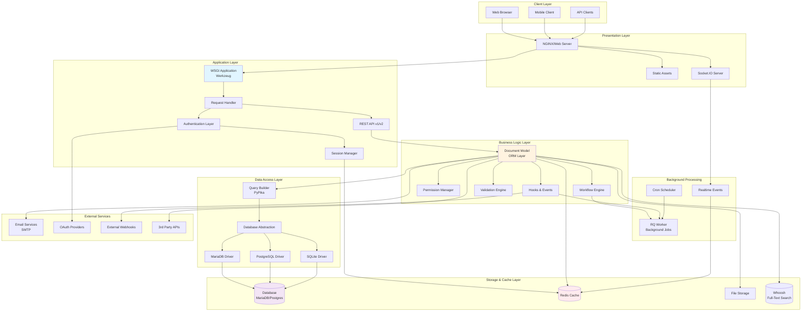

## Core Components Architecture

### 1. Document Model Architecture

The document model is the heart of Frappe Framework, implementing a metadata-driven ORM pattern.

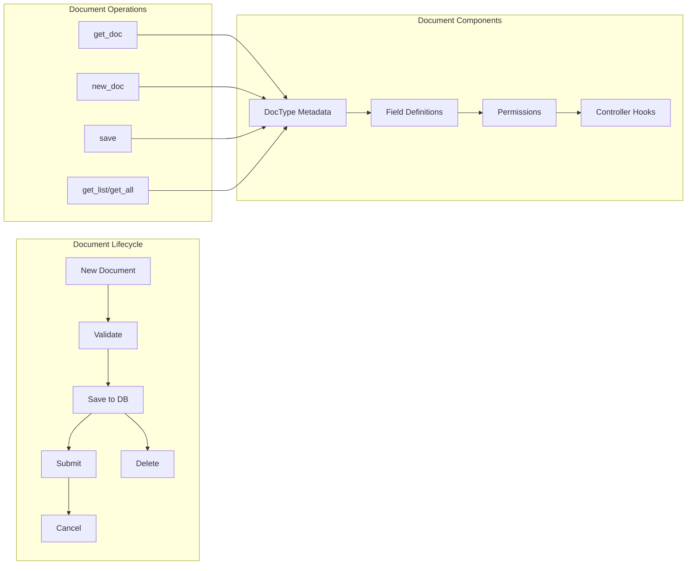

**Key Classes:**
- `Document`: Base class for all documents
- `Meta`: Metadata container for DocTypes
- `BaseDocument`: Core document functionality
- `DocField`: Field definitions and validations

### 2. Database Architecture

Multi-database support with a unified abstraction layer.

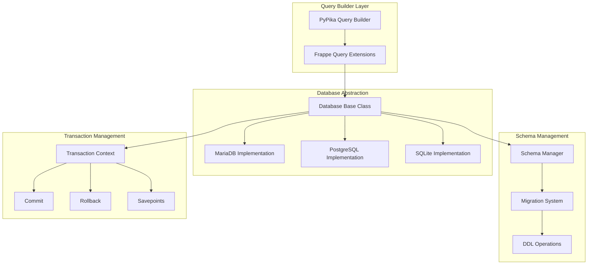

**Key Components:**
- `Database`: Base database abstraction
- `MariaDBDatabase`: MariaDB-specific implementation
- `PostgresDatabase`: PostgreSQL-specific implementation
- `Schema`: Schema management and migrations
- `DBQuery`: Advanced query builder

### 3. API Architecture

Versioned REST API with automatic resource generation.

```mermaid
graph TB
    subgraph "API Entry Points"
        REQUEST[HTTP Request]
        API_HANDLER[API Handler]
        VERSION_ROUTER[Version Router]
    end
    
    subgraph "API v1"
        V1_METHOD[/api/v1/method/*]
        V1_RESOURCE[/api/v1/resource/*]
        V1_DOC[/api/v1/resource/:doctype/:name]
    end
    
    subgraph "API v2"
        V2_METHOD[/api/v2/method/*]
        V2_RESOURCE[/api/v2/resource/*]
        V2_DOC[/api/v2/resource/:doctype/:name]
    end
    
    subgraph "API Operations"
        WHITELIST[Whitelist Check]
        AUTH_CHECK[Authorization]
        EXECUTE[Execute Method]
        SERIALIZE[Serialize Response]
    end
    
    subgraph "Resource Operations"
        GET_OP[GET - Read]
        POST_OP[POST - Create]
        PUT_OP[PUT - Update]
        DELETE_OP[DELETE - Remove]
        LIST_OP[LIST - Query]
    end
    
    REQUEST --> API_HANDLER
    API_HANDLER --> VERSION_ROUTER
    
    VERSION_ROUTER --> V1_METHOD
    VERSION_ROUTER --> V1_RESOURCE
    VERSION_ROUTER --> V1_DOC
    
    VERSION_ROUTER --> V2_METHOD
    VERSION_ROUTER --> V2_RESOURCE
    VERSION_ROUTER --> V2_DOC
    
    V1_METHOD --> WHITELIST
    V1_RESOURCE --> AUTH_CHECK
    V1_DOC --> AUTH_CHECK
    
    WHITELIST --> EXECUTE
    AUTH_CHECK --> EXECUTE
    EXECUTE --> SERIALIZE
    
    V1_DOC --> GET_OP
    V1_DOC --> POST_OP
    V1_DOC --> PUT_OP
    V1_DOC --> DELETE_OP
    V1_RESOURCE --> LIST_OP
```

**API Features:**
- Automatic REST endpoint generation
- Versioning (v1, v2)
- Whitelist-based security
- Filter and pagination support
- Custom method exposure

### 4. Authentication & Authorization Architecture

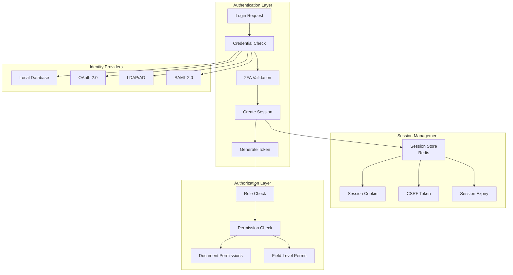

**Security Features:**
- JWT-based authentication
- OAuth 2.0 support
- Two-factor authentication (OTP)
- LDAP integration
- CSRF protection
- Role-based access control (RBAC)
- Document-level permissions
- Field-level security

### 5. Real-time Communication Architecture

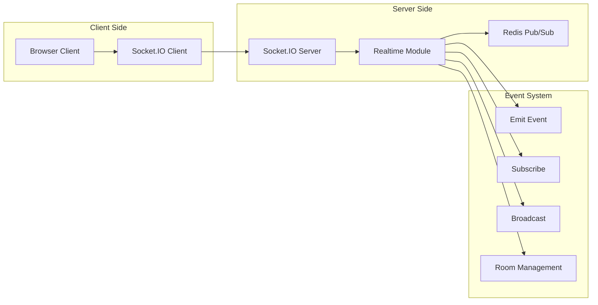

### 6. Background Job Architecture

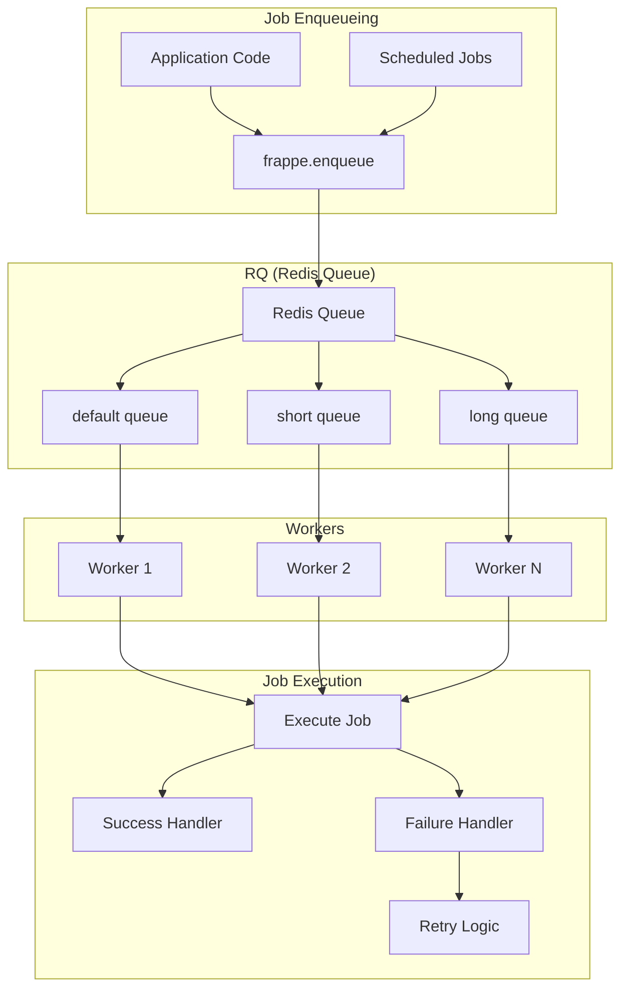

## Data Flow Architecture

### Request-Response Flow

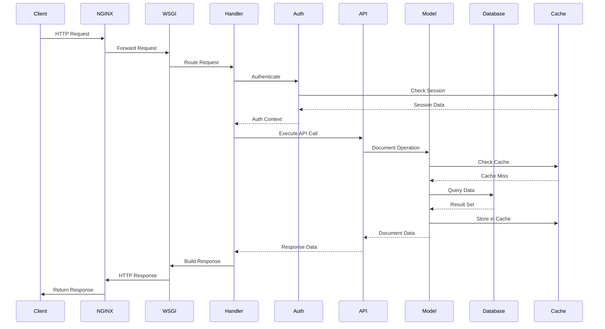

### Document Lifecycle Flow

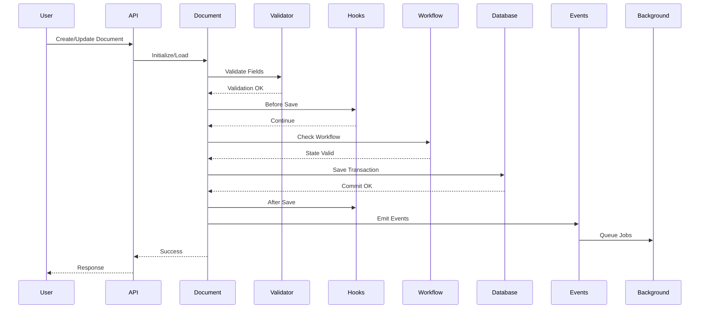

## Technology Stack Details

### Backend Stack

| Component | Technology | Purpose |
|-----------|-----------|---------|
| Language | Python 3.10+ | Core application logic |
| Web Framework | Werkzeug | WSGI application server |
| ORM | Custom Document Model | Metadata-driven data access |
| Query Builder | PyPika | SQL query construction |
| Database Drivers | mysqlclient, psycopg2, sqlite3 | Database connectivity |
| Validation | RestrictedPython | Safe Python execution |
| Template Engine | Jinja2 | Server-side templating |
| Task Queue | RQ (Redis Queue) | Background job processing |
| Caching | Redis | Session, cache, pub/sub |
| Search | Whoosh | Full-text search indexing |
| PDF Generation | WeasyPrint | Report generation |
| Authentication | PyJWT, OAuth | Security |

### Frontend Stack

| Component | Technology | Purpose |
|-----------|-----------|---------|
| Framework | Vue 3 | UI framework |
| State Management | Pinia, Vuex | Application state |
| UI Components | Bootstrap 4.6 | UI toolkit |
| Charts | Frappe Charts | Data visualization |
| Data Tables | Frappe DataTable | Grid component |
| Editor | Quill, EditorJS | Rich text editing |
| Build Tool | esbuild | Asset bundling |
| Real-time | Socket.IO Client | WebSocket communication |

### Infrastructure

| Component | Technology | Purpose |
|-----------|-----------|---------|
| Web Server | NGINX/Gunicorn | HTTP server |
| Database | MariaDB 10.3+ | Primary database |
| Cache | Redis 6.0+ | Caching layer |
| Queue | Redis Queue | Background jobs |
| Process Manager | Supervisor/systemd | Service management |
| Container | Docker | Containerization |

## Key Design Patterns

### 1. Metadata-Driven Development
- **Pattern**: DocType definitions drive UI, API, and database schema
- **Benefit**: Rapid application development without code
- **Implementation**: JSON-based DocType definitions

### 2. Document-Oriented ORM
- **Pattern**: Documents as first-class objects with lifecycle hooks
- **Benefit**: Consistent data access patterns
- **Implementation**: `Document` base class with hooks

### 3. Plugin Architecture
- **Pattern**: Apps extend framework functionality
- **Benefit**: Modular, extensible architecture
- **Implementation**: Hooks and app structure

### 4. Event-Driven Processing
- **Pattern**: Hooks trigger on document lifecycle events
- **Benefit**: Decoupled business logic
- **Implementation**: `before_save`, `after_insert`, etc.

### 5. Multi-Tenancy
- **Pattern**: Site-based isolation
- **Benefit**: Multiple applications on single deployment
- **Implementation**: Site context management

## Security Architecture

### Defense in Depth

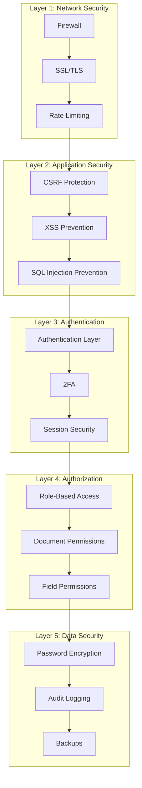

## Performance Optimization Strategies

1. **Caching Layers**
   - Redis-based distributed cache
   - Client-side cache
   - Query result caching
   - Metadata caching

2. **Database Optimization**
   - Query builder optimization
   - Indexing strategies
   - Connection pooling
   - Read replicas support

3. **Asset Optimization**
   - JavaScript/CSS bundling and minification
   - Image optimization
   - CDN support
   - Lazy loading

4. **Background Processing**
   - Async job execution
   - Queue-based processing
   - Scheduled task execution

## Scalability Architecture

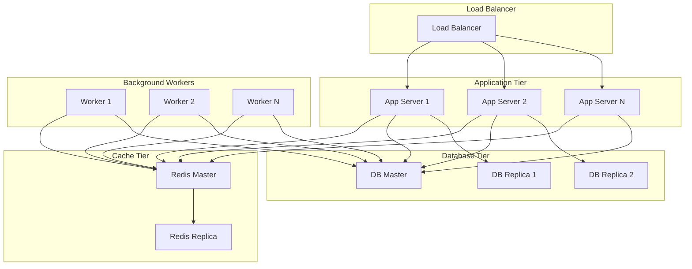

## Integration Boundaries

### External Service Integration Points

1. **Email Services**: SMTP, IMAP integration
2. **OAuth Providers**: Google, Facebook, GitHub, Custom
3. **Payment Gateways**: Stripe, PayPal, Razorpay
4. **Cloud Storage**: S3, Google Cloud Storage, Azure Blob
5. **SMS Gateways**: Twilio, custom providers
6. **Webhooks**: Outbound webhook support
7. **APIs**: RESTful API exposure and consumption
8. **LDAP/AD**: Enterprise authentication
9. **Search Engines**: External search integration

## Deployment Architecture

### Typical Production Deployment

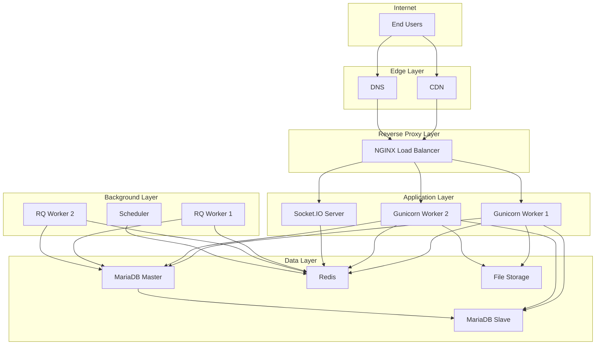

## Monitoring & Observability

### Key Metrics

1. **Application Metrics**
   - Request rate and latency
   - Error rates
   - Document operation rates
   - Background job metrics

2. **Database Metrics**
   - Query performance
   - Connection pool usage
   - Slow query log
   - Replication lag

3. **Cache Metrics**
   - Hit/miss ratio
   - Memory usage
   - Key eviction rate

4. **System Metrics**
   - CPU, memory, disk usage
   - Network I/O
   - Process counts

### Observability Tools

- **Logging**: Python logging, structured logs
- **Tracing**: Request ID tracking, distributed tracing support
- **Monitoring**: Prometheus, Grafana integration
- **Error Tracking**: Sentry integration

## Summary

Frappe Framework provides a comprehensive, production-ready platform for building enterprise applications. Its metadata-driven approach, combined with powerful ORM, REST API, and background processing capabilities, enables rapid development while maintaining scalability and security.

**Key Strengths:**
- Metadata-driven development
- Automatic API generation
- Built-in admin interface
- Comprehensive permission system
- Multi-database support
- Real-time capabilities
- Extensible plugin architecture

**Ideal Use Cases:**
- ERP systems
- CRM applications
- Custom business applications
- SaaS platforms
- Internal tools and dashboards
