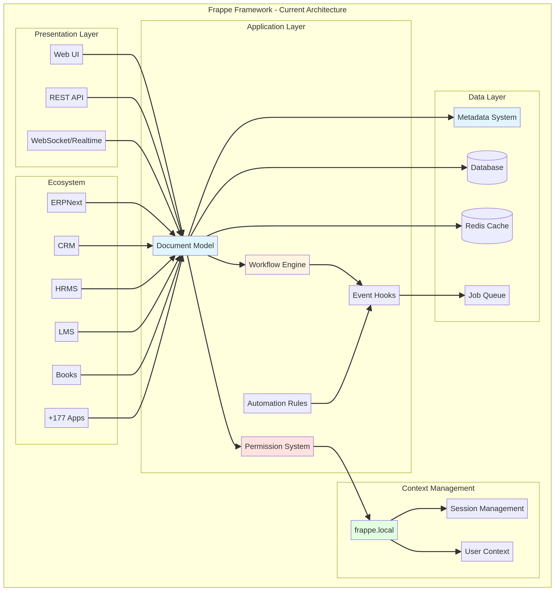
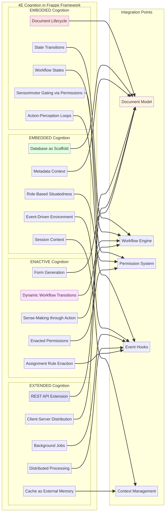
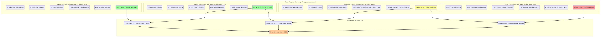
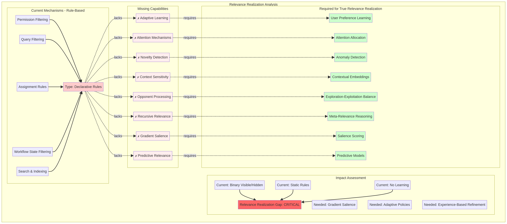
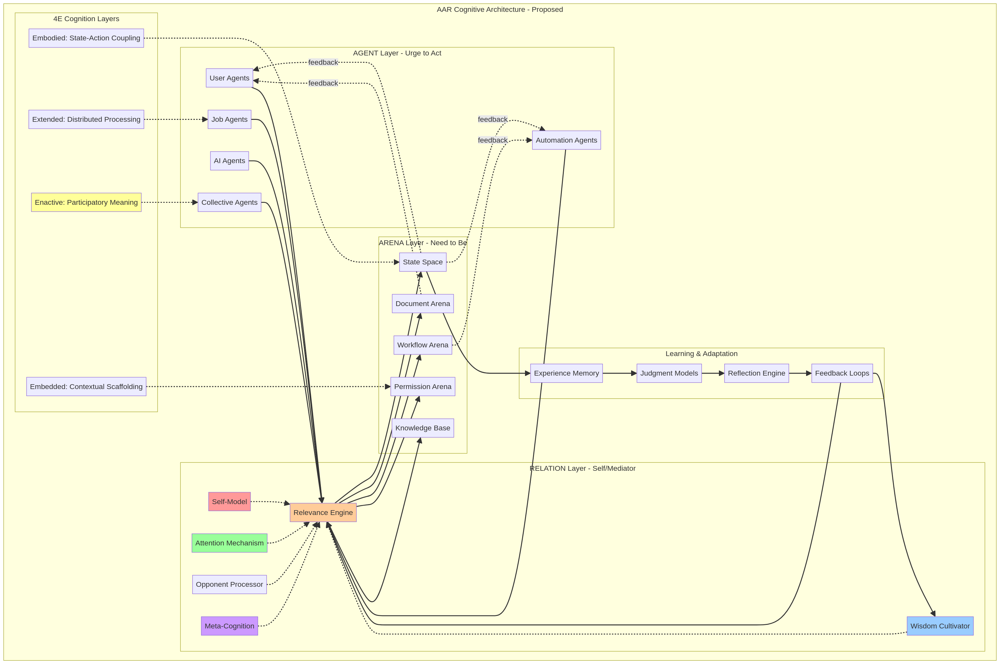

# Frappe Framework: A Cognitive Architecture Evaluation

**Author**: Manus AI
**Date**: November 8, 2025

## Abstract

This report provides a comprehensive analysis of the Frappe Framework, as represented in the `cogpy/org-frappe` repository, evaluated as a cognitive architecture. The analysis is conducted through the theoretical lens of 4E (Embodied, Embedded, Extended, Enactive) cognition and John Vervaeke's philosophical framework on relevance realization, wisdom cultivation, and the meaning crisis. The study reveals that while Frappe implicitly exhibits many characteristics of a 4E cognitive system, it lacks the adaptive, participatory, and self-aware mechanisms necessary for genuine intelligence and wisdom. The report identifies the framework's cognitive strengths, diagnoses critical gaps in its architecture, and provides actionable recommendations for its evolution. These recommendations focus on integrating an Agent-Arena-Relation (AAR) orchestration layer, adaptive relevance realization, and mechanisms for wisdom cultivation to transform Frappe from a transactional data-processing system into a participatory meaning-making ecology.

---

## 1. Introduction

The Frappe Framework is a powerful, low-code, full-stack web framework written in Python and JavaScript, designed for building complex, real-world applications [1]. Its most notable implementation is ERPNext, a comprehensive Enterprise Resource Planning system, but its ecosystem includes over 180 applications, from Customer Relationship Management (CRM) to Learning Management Systems (LMS). This evaluation moves beyond a conventional software architecture review to analyze Frappe as a **cognitive architecture**—a system that processes information, makes decisions, and interacts with its environment in a manner analogous to a cognitive agent.

The analytical lens for this evaluation is drawn from two interconnected fields of cognitive science and philosophy: **4E Cognition** and **John Vervaeke's work on the meaning crisis** [2]. 4E cognition posits that cognitive processes are not confined to the brain but are **Embodied** (shaped by the body), **Embedded** (situated in the environment), **Extended** (reliant on external tools), and **Enactive** (arising through action). Vervaeke's framework builds on this by exploring how cognitive agents realize relevance, cultivate wisdom, and overcome the "meaning crisis"—a failure to find a coherent and compelling sense of purpose and connection.

By applying these frameworks, we can assess Frappe's capacity for intelligent behavior, identify its cognitive limitations, and chart a course for its transformation into a system that doesn't just process data, but participates in the cultivation of wisdom and meaning.

## 2. System Architecture Overview

The Frappe Framework is built around a document-centric, metadata-driven architecture. At its core is the `Document` model, a versatile abstraction for all system entities. This model is supported by a sophisticated workflow engine, a granular permission system, and an event-driven hooks system that enables a high degree of automation and customization.

The key architectural components include:

*   **Document Model**: A central abstraction for all data entities, managed through a metadata system (DocTypes).
*   **Workflow Engine**: A state machine that governs document lifecycles through conditional, role-based transitions.
*   **Permission System**: A multi-layered mechanism for controlling access and actions based on user, role, and document state.
*   **Metadata System**: An explicit ontology that defines the structure, behavior, and relationships of all DocTypes.
*   **Event Hooks & Automation**: A reactive system for triggering actions based on system events, enabling automation rules, notifications, and background jobs.
*   **Context Management**: A thread-local context (`frappe.local`) that maintains situational awareness of the user, session, and request.

This architecture supports a vast ecosystem of applications, all built upon the same core cognitive scaffolding. The diagram below illustrates the high-level structure of the current framework.

*Figure 1: A high-level visualization of the current Frappe Framework architecture, highlighting the central role of the Document model and its interaction with the workflow, permission, and metadata systems.*

## 3. 4E Cognitive Analysis

While not explicitly designed as such, the Frappe Framework's architecture exhibits strong parallels with the principles of 4E cognition.

*Figure 2: Mapping of 4E cognition principles to the core components of the Frappe Framework.*

### 3.1. Embodied Cognition

Embodied cognition asserts that cognition is shaped by the body's interactions with the world. In Frappe, the `Document` acts as the "body," and its state-dependent lifecycle mirrors an embodied process. The `docstatus` (Draft, Submitted, Cancelled) constrains possible actions, much like a body's physical state constrains its affordances. The workflow engine enacts this embodiment, allowing the system to "sense" its current state and "act" by transitioning to a new one. The permission system functions as a form of sensorimotor gating, filtering what actions are possible based on the document's state and the user's role.

### 3.2. Embedded Cognition

Embedded cognition emphasizes the role of the environment in structuring cognitive processes. Frappe is deeply embedded in its database, which serves as a persistent environmental scaffold. The metadata system provides a rich semantic context that shapes how information is structured and interpreted. Furthermore, the `frappe.local` context manager ensures that all operations are situated within a specific user-session-site configuration, creating a highly contextualized and embedded cognitive environment.

### 3.3. Extended Cognition

Extended cognition proposes that cognitive processes can extend beyond the brain and body into external tools. Frappe demonstrates this through its REST API, which extends the system's cognitive reach to other applications. The Redis-based caching system functions as an external memory, while the background job queue extends cognitive processing across time and multiple processes. The client-server architecture itself represents an extended mind, with cognitive load distributed between the frontend and backend.

### 3.4. Enactive Cognition

Enactive cognition views cognition as arising through the dynamic interaction between an agent and its environment. In Frappe, this is most evident in the workflow and permission systems. Workflow transitions are not pre-programmed scripts but emerge from the interaction of conditions, user actions, and document state. Permissions are not static attributes but are enacted dynamically through the `has_permission` function, which evaluates a complex set of contextual factors. The system's interface and affordances are thus enacted through interaction rather than existing a priori.

## 4. Evaluation from the Meaning Crisis Perspective

Applying Vervaeke's framework reveals deeper insights into Frappe's cognitive capabilities and limitations, particularly concerning its ability to realize relevance and cultivate wisdom.

### 4.1. The Four Ways of Knowing

Vervaeke proposes four interdependent ways of knowing. Frappe's implementation of these is uneven, as summarized in the diagram below.

*Figure 3: An assessment of the Frappe Framework's implementation of Vervaeke's four ways of knowing, highlighting a critical deficiency in participatory knowledge.*

| Knowing Type   | Frappe's Implementation                                                              | Score | Assessment                                 |
| :------------- | :----------------------------------------------------------------------------------- | :---- | :----------------------------------------- |
| **Procedural** | Workflows, automation rules, and event handlers encode procedural knowledge.         | 6/10  | **Strong but Static**: Procedures are fixed and cannot be learned or refined through practice. |
| **Propositional**| Metadata, database schema, and DocTypes encode a rich ontology of facts.             | 7/10  | **Rich but Fixed**: Propositions are declared and cannot be revised based on experience. |
| **Perspectival** | Role-based permissions and session context create situated, state-dependent views.    | 5/10  | **Limited to Roles**: Perspectives are pre-defined and cannot be dynamically constructed or transformed. |
| **Participatory**| Interaction is transactional, not transformative. There is no co-constitution of user and system. | 1/10  | **Critically Absent**: The system processes data but does not participate in shared meaning-making. |

The framework excels at encoding **procedural** and **propositional** knowledge but is weak in **perspectival** knowing and almost entirely lacks **participatory** knowing. This imbalance is a primary symptom of the meaning crisis in software: an abundance of information and procedure without the transformative engagement that leads to wisdom.

### 4.2. Relevance Realization

Relevance realization is the fundamental cognitive process of filtering information to determine what matters in a given context. Frappe implements several rule-based relevance filters, such as permissions, query filters, and workflow states. However, these mechanisms are static and declarative.

*Figure 4: Analysis of the gap between Frappe's current rule-based filtering and the requirements for true, adaptive relevance realization.*

As the analysis shows, Frappe's current architecture lacks the core components of genuine relevance realization:

*   **No Adaptive Learning**: The system cannot learn what is relevant to users from their behavior.
*   **No Attention Mechanism**: It lacks a mechanism for gradient salience, treating all visible information with equal importance.
*   **No Opponent Processing**: It cannot balance competing demands, such as exploration versus exploitation or novelty versus priority.

This gap is the single most critical cognitive limitation of the framework. Without adaptive relevance realization, the system is confined to executing pre-programmed logic and cannot develop genuine intelligence or wisdom.

## 5. Cognitive Strengths and Critical Gaps

The analysis reveals a clear pattern of strengths in structured, rule-based processing and critical gaps in adaptive, participatory intelligence.

### 5.1. Summary of Strengths

*   **Rich Metadata Architecture**: Enables structural self-awareness.
*   **Event-Driven Architecture**: Creates potential for enactive, emergent behavior.
*   **Workflow State Machines**: Embodies procedural knowledge and context-dependent action.
*   **Permission System**: Implements a basic, rule-based form of relevance filtering.
*   **Distributed Processing**: Demonstrates extended cognition across a modular ecosystem.
*   **Context Management**: Provides a foundation for situated, embedded cognition.

### 5.2. Summary of Critical Gaps

The following table summarizes the most critical cognitive gaps identified in the Frappe Framework, their impact, and their priority for remediation.

| Gap                                   | Impact                                                                                             | Priority |
| :------------------------------------ | :------------------------------------------------------------------------------------------------- | :------- |
| **No Adaptive Relevance Realization** | Prevents the system from learning what matters; confines it to rule-following.                     | Critical |
| **Absence of Participatory Knowledge**  | Interaction remains transactional, preventing transformative meaning-making and wisdom cultivation. | Critical |
| **No Learning or Adaptation**         | The system cannot improve over time, adapt to new contexts, or develop judgment.                 | Critical |
| **Lack of Self-Model and Identity**   | Prevents metacognition, self-improvement, and purpose-driven behavior.                           | High     |
| **No Attention Mechanism**            | Cognitive resources are not allocated based on importance, leading to inefficiency.                | High     |
| **No Opponent Processing**            | The system cannot navigate trade-offs or balance competing goals wisely.                         | High     |

## 6. Recommendations and Integration Opportunities

To address these gaps and transform Frappe into a genuine cognitive architecture, we propose a series of architectural enhancements centered on the **Agent-Arena-Relation (AAR)** model. This model provides a unifying framework for orchestrating the interaction between agents (users, AI, automation) and their environment (the arena of data and state) through a mediating relation layer that embodies the system's self-model and intelligence.

*Figure 5: A proposed Agent-Arena-Relation (AAR) cognitive architecture for the Frappe Framework, designed to enable adaptive relevance realization, wisdom cultivation, and participatory meaning-making.*

### 6.1. Opportunity 1: Implement an Adaptive Relevance Realization Layer

Instead of relying on static permission rules, this layer would use machine learning to predict what is relevant to each user based on their behavior, context, and goals. This involves building user embeddings, training relevance prediction models, and replacing binary filtering with gradient salience scores.

### 6.2. Opportunity 2: Build an Agent-Arena-Relation (AAR) Orchestration Layer

This involves creating explicit abstractions for **Agents** (users, rules, jobs), the **Arena** (the state space of documents and workflows), and a mediating **Relation** layer. The Relation layer would house the system's intelligence, including the relevance engine, a self-model, and wisdom cultivation mechanisms, orchestrating all agent-arena interactions.

### 6.3. Opportunity 3: Add Learning and Wisdom Cultivation Mechanisms

This requires implementing feedback loops that allow the system to learn from the outcomes of its actions. By tracking the success of workflow transitions, assignments, and other decisions, the system can use reinforcement learning to refine its policies and develop judgment. A `WisdomCultivator` component would be responsible for this learning process.

### 6.4. Opportunity 4: Develop a Self-Model and Meta-Cognition

An explicit `SelfModel` should be implemented to represent the system's identity, capabilities, limitations, and purpose. This would enable the system to reason about its own processes, question its assumptions, and engage in self-improvement, forming the basis for genuine meta-cognition.

## 7. Conclusion

The Frappe Framework, while a powerful and flexible application platform, currently operates as a sophisticated but non-intelligent information-processing system. Its architecture exhibits many implicit features of 4E cognition, providing a robust foundation for future development. However, it suffers from the core symptoms of Vervaeke's meaning crisis: an inability to realize relevance adaptively, a lack of participatory engagement, and an absence of mechanisms for wisdom cultivation.

The path forward lies in transforming Frappe from a transactional framework into a participatory cognitive ecology. By integrating an AAR orchestration layer, adaptive relevance realization, and mechanisms for learning and self-awareness, Frappe can evolve into a system that doesn't just manage business processes but actively participates in the cultivation of organizational wisdom and meaning.

This represents a paradigm shift from building systems that follow rules to designing ecologies that cultivate intelligence. It is an ambitious but necessary step for software architecture to awaken from its own meaning crisis and contribute to a more wise and connected world.

---

## 8. References

[1] Frappe. (2025). *cogpy/org-frappe GitHub Repository*. [https://github.com/cogpy/org-frappe](https://github.com/cogpy/org-frappe)

[2] Vervaeke, J. (2019). *Awakening from the Meaning Crisis* [Video series]. YouTube. [https://www.youtube.com/playlist?list=PLND1JCRq8Vuh3f0P5qjrSdb5eC1ZfZwWJ](https://www.youtube.com/playlist?list=PLND1JCRq8Vuh3f0P5qjrSdb5eC1ZfZwWJ)
